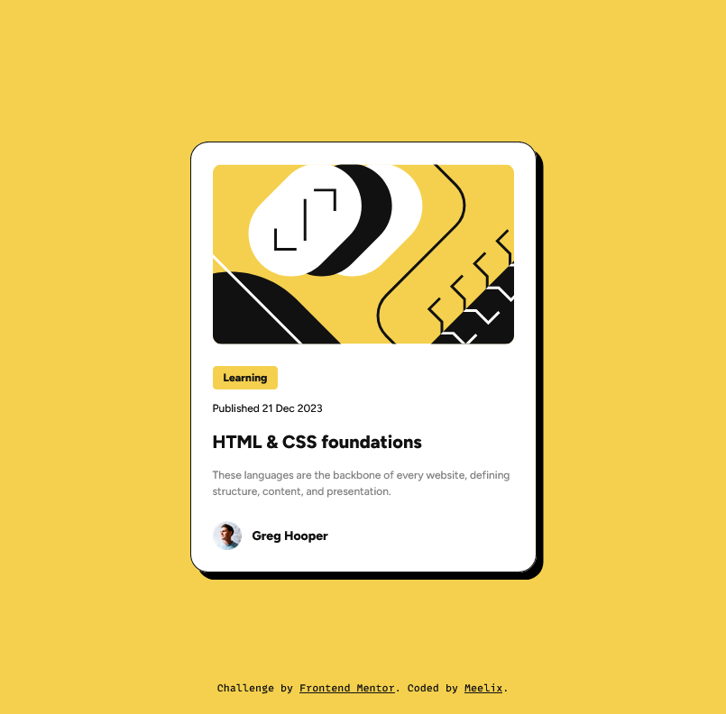

# Frontend Mentor - Blog preview card solution

This is a solution to the [Blog preview card challenge on Frontend Mentor](https://www.frontendmentor.io/challenges/blog-preview-card-ckPaj01IcS). Frontend Mentor challenges help you improve your coding skills by building realistic projects. 

## The challenge

Users should be able to:

- [x] See hover and focus states for all interactive elements on the page

## Screenshot

## Links

- [Solution URL](https://your-solution-url.com)
- [Live Site URL](https://meelix.github.io/frontendmentor-blog-card)

## Built with

- Native css nesting
- Css grid

## Useful resources

- [Transfonter](https://transfonter.org/) - Usefull to reduce font file sizes and generate css for `@font-face`.